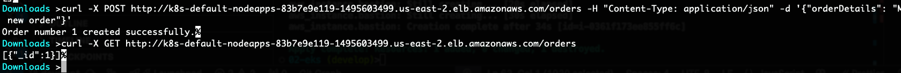
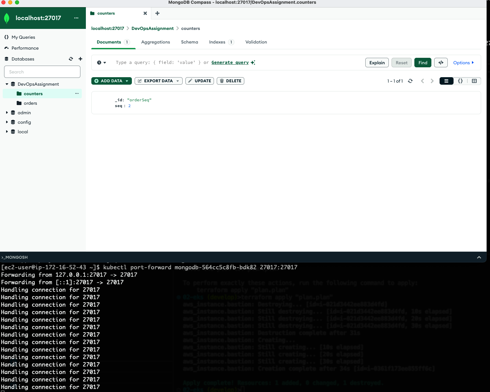

# Seinor DevOps Engineer Home Assignment

## DNS notes:
No DNS hosted zones in Route53 and tls certificates weren't bought - to save money of course - the application is avaible online but with AWS's defaults http DNS provided names.
### ArgoCD:
https://a7c2a36ee8a0b40498fdcd385161cfeb-1904246993.us-east-2.elb.amazonaws.com/
### application:
http://k8s-default-nodeapps-83b7e9e119-1495603499.us-east-2.elb.amazonaws.com

## Overview:
* Infra
* Application
* ArgoCD

### Infra
* All the network stuff (vpc, subnets, NAT, etc...)
* EKS in private subnet (of course)
* Autoscale groups
* Bastion for EKS
* EKS addons for ingress controller and other stuff
* S3 backend for state files
* Every resourse is tagged with "DevOps_task = true"
* Run destroy freely

### App
* Dockerfile 
* Helm-chart for the app

### ArgoCD
* Deploys mongo
* Deploys App

## Extras:
### connect to mongo-atlas-client:
From terminal: 
```
ssh -i "<key>" -L 27017:localhost:27017 <user>@<bastion-host>  -o ServerAliveInterval=1800
```
From another terminal window:
```
ssh -i "<key>" <user>@<bastion-host>
```
```
kubectl port-forward <mongodb-pod> 27017:27017
```


### Deploy new version:
**connect your AWS credentials** 
```
aws ecr-public get-login-password --region us-east-1 | docker login --username AWS --password-stdin public.ecr.aws/x2j4b2n8
```
```
docker build -t node-app .
```
```
docker tag node-app:latest public.ecr.aws/x2j4b2n8/node-app:latest
```
```
docker push public.ecr.aws/x2j4b2n8/node-app:latest
```
#### ArgoCD will sync the changes automaticlly.

**Argo credentials + bastion key sent in the mail.**

P.S - There is unlimited stuff that can be added and built on top of this deplyment - focused on Argo deployment and infra, will showcase the code and next steps in the next frontal interview (hopefully).
such as:
* Add git actions to change ArgoTag automaticlly 
* Grafana
* Secrets
* Scaling
* Security (JWT, db etc...)
* Persistence
and many many more...
